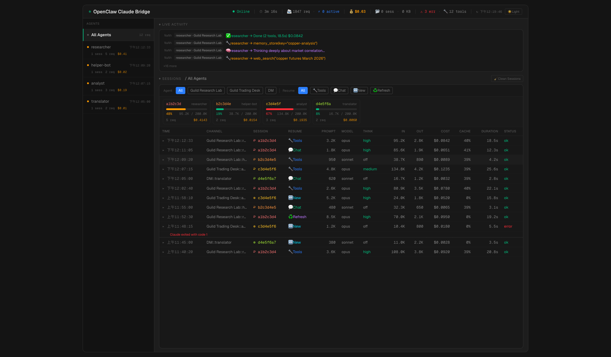

# openclaw-claude-bridge

[](LICENSE)
[](https://nodejs.org/)
[](https://docs.anthropic.com/en/docs/claude-code)

[English](README.md) | 繁體中文

一個 OpenAI 相容的 HTTP Proxy，讓 [OpenClaw](https://github.com/openclaw/openclaw) agents 可以透過 [Claude Code CLI](https://docs.anthropic.com/en/docs/claude-code) 使用 Claude —— 支援工具調用、Session 記憶和延伸思考。

---

## 為什麼需要這個

OpenClaw 使用 OpenAI API 格式。Claude Code CLI 使用自己的格式。這個 Bridge 位於中間負責翻譯 —— 讓你的 OC agents 可以與 Claude 對話，雙方都無需修改。

```
  OpenClaw agent                  Bridge                     Claude CLI
  (Discord/Telegram)
        │                           │                              │
        │  POST /v1/chat/           │                              │
        │  completions              │  轉換訊息格式                  │
        ├──────────────────────────▶│  注入工具協議                  │
        │                           │  映射思考等級                  │
        │                           │                              │
        │                           │  stdin ──▶ claude --print    │
        │                           │  stdout ◀── stream-json      │
        │                           │                              │
        │  SSE stream               │  解析回應：                   │
        ◀──────────────────────────│  ├─ 文字 → 乾淨輸出            │
        │                           │  └─ <tool_call> → OpenAI 格式 │
        │                           │                              │
        │  tool_calls?              │                              │
        │  有 → OC 執行工具          │                              │
        │  無 → 答案回傳給用戶       │                              │
```

**核心原則：** Bridge 從不執行工具。它只負責翻譯。OpenClaw 擁有工具循環。

---

## 快速開始

```bash
# 1. Clone 並安裝（會自動 build Dashboard）
git clone https://github.com/shinglokto/openclaw-claude-bridge.git
cd openclaw-claude-bridge
npm install

# 2. 設定
cp .env.example .env
# 編輯 .env — 檢查設定，修改 DASHBOARD_PASS

# 3. 確認 Claude CLI 已安裝並登入
claude --version
claude auth status

# 4. 啟動
npm start

# 5. 健康檢查
curl http://localhost:3456/health
```

---

## 運作原理

### 請求流程

1. **OpenClaw** 發送標準 OpenAI chat completion 請求（messages, tools, model）
2. **Bridge** 將訊息轉換為 Claude CLI 文字格式，並將工具調用指令注入到 system prompt
3. **Claude CLI** 處理請求並串流回應
4. **Bridge** 解析回應 — 如果 Claude 需要調用工具，將 `<tool_call>` XML 轉換為 OpenAI `tool_calls` 格式；否則返回乾淨文字
5. **OpenClaw** 要麼執行所請求的工具再發送新請求，要麼將最終答案傳遞給用戶

### Session 記憶

每個 agent 在每個對話中都擁有自己的持久 Claude CLI session。也就是說 Claude 會記住之前的訊息，Bridge 無需每次重新發送完整歷史。

```
Discord #general — 兩個 agent 共享同一個 channel：

  researcher（第一條訊息）  → 建立新 session（session-aaa）
  helper-bot（第一條訊息）  → 建立新 session（session-bbb）
  researcher（第二條訊息）  → 恢復 session-aaa（只發送新訊息）
  用戶在 OC 執行 /new       → 舊 session 清除，建立新的
```

路由鍵為 `channel + agent 名稱`，因此同一 channel 中的 agents 不會互相干擾。

Session 狀態可跨重啟保留 — 映射和請求紀錄儲存在 `state.json`，啟動時自動恢復。過期的 session（CLI session 檔案已不存在）會自動清除。

更多技術細節請參閱 [docs/architecture.md](docs/architecture.md)。

### 工具調用

Bridge 從 OpenClaw 的請求讀取 `tools` 陣列，動態生成工具調用指令並注入到 Claude 的 system prompt。Claude 輸出 `<tool_call>` XML 區塊，Bridge 將其轉換為標準 OpenAI `tool_calls`。

這意味著 OpenClaw 新增的任何工具都自動可用 — 無需修改 Bridge。

Claude 的原生工具（Bash, Read, Write 等）透過 `--tools ""` 禁用，使其只能透過 OpenClaw 的 gateway 調用工具。

### 延伸思考

Bridge 透過 `reasoning_effort` 參數支援 Claude 的延伸思考：

| `reasoning_effort` | Claude CLI `--effort` | 行為 |
|---|---|---|
| *（未設定）* | *（預設）* | 思考關閉 |
| `minimal` / `low` | `low` | 快速直覺 |
| `medium` | `medium` | 中等推理 |
| `high` / `xhigh` | `high` | 深度逐步推理 |

當 `reasoning_effort` 未提供時，思考會完全關閉（`MAX_THINKING_TOKENS=0`）。

---

## Dashboard

Bridge 包含一個 React Dashboard，可在 `http://<伺服器IP>:3458/` 存取。



**Header 列** — 頂部即時指標：在線/離線狀態、運行時間、總請求數、活躍請求、總成本、session 數量 + 磁碟大小、錯誤數、可用工具數，以及深色/淺色主題切換。

**Agent 側邊欄** — 列出所有 agents，按最近活動排序。每個顯示活動指示燈（5 分鐘內活躍為綠色、30 分鐘內為琥珀色、閒置為灰色）、session 數、請求數和成本。選擇 agent 會過濾所有面板。手機版會摺疊成水平 pill bar。

**即時活動動態** — 即時事件串流，包含 emoji 編碼的訊息：🧠 思考中、🔧 工具調用、🔄 恢復、♻️ 上下文刷新、✅ 完成、❌ 錯誤。顯示相對時間戳和 agent/channel 標籤。

**Context 卡片** — 按 session 顯示上下文窗口使用量，附帶進度條。顏色編碼：綠色（<40%）、琥珀色（40–65%）、紅色（>65%）。每張卡片顯示 session ID、agent、token 數量和成本。

**請求表格** — 13 欄表格顯示每個請求：時間、channel、session（顏色編碼）、恢復方式（emoji 標記：🔧 工具、💬 對話、🆕 新建、♻️ 刷新等）、prompt 大小、模型、思考等級、輸入/輸出 tokens、成本、快取命中率、耗時和狀態。每行可展開顯示活動紀錄和錯誤詳情。支援 channel 和恢復方式過濾，以及分頁。

**Session 清理** — 一鍵清除超過 24 小時的 CLI sessions。

**密碼保護：** 設定 `DASHBOARD_PASS` 環境變數以啟用 HTTP Basic Auth（用戶名：`admin`）。如果未設定，Dashboard 開放存取。

Dashboard 詳細架構請參閱 [docs/architecture.md](docs/architecture.md#dashboard)。

---

## 設定

### 環境變數

| 變數名 | 必填 | 預設值 | 說明 |
|---|---|---|---|
| `DASHBOARD_PASS` | 否 | — | Dashboard 密碼（Basic Auth，用戶名：`admin`） |
| `OPUS_MODEL` | 否 | `opus` | Opus 的 CLI 模型別名 |
| `SONNET_MODEL` | 否 | `sonnet` | Sonnet 的 CLI 模型別名 |
| `HAIKU_MODEL` | 否 | `haiku` | Haiku 的 CLI 模型別名 |
| `IDLE_TIMEOUT_MS` | 否 | `120000` | Claude CLI 無輸出超過此毫秒數後終止 |
| `OPENCLAW_BRIDGE_PORT` | 否 | `3456` | API 伺服器端口 |
| `OPENCLAW_BRIDGE_STATUS_PORT` | 否 | `3458` | Dashboard 端口 |
| `CLAUDE_BIN` | 否 | `claude` | Claude Code CLI 路徑 |
| `MAX_PER_CHANNEL` | 否 | `2` | 每個 channel 最大同時請求數 |
| `MAX_GLOBAL` | 否 | `20` | 全局最大同時請求數 |

### 端口

| 端口 | 綁定 | 用途 |
|---|---|---|
| `3456` | `127.0.0.1` | OpenAI 相容 API（僅本機） |
| `3458` | `0.0.0.0` | Dashboard（區域網絡可存取） |

---

## OpenClaw 設定

在 OpenClaw 設定檔（`~/.openclaw/openclaw.json`）中新增 provider：

```json
{
  "models": {
    "providers": {
      "claude-bridge": {
        "baseUrl": "http://localhost:3456/v1",
        "apiKey": "not-needed",
        "api": "openai-completions",
        "models": [
          {
            "id": "claude-opus-latest",
            "name": "Claude Opus",
            "contextWindow": 200000,
            "maxTokens": 128000,
            "reasoning": true
          },
          {
            "id": "claude-sonnet-latest",
            "name": "Claude Sonnet",
            "contextWindow": 200000,
            "maxTokens": 64000,
            "reasoning": true
          }
        ]
      }
    }
  }
}
```

然後將模型指定給你的 agent。`apiKey` 可以是任何非空字串 — Bridge 不會驗證。

---

## 服務設定（開機自動啟動）

### macOS（launchd）

```bash
# 推薦：自動偵測路徑、讀取 .env、生成 plist
./service/install-mac.sh
```

手動管理：

```bash
# 狀態
launchctl list | grep openclaw-claude-bridge

# 重啟（重載 plist 設定）
launchctl bootout gui/$(id -u)/com.openclaw.claude-bridge
launchctl bootstrap gui/$(id -u) ~/Library/LaunchAgents/com.openclaw.claude-bridge.plist

# 日誌
tail -f ~/openclaw-claude-bridge/bridge.log
```

### Linux（systemd）

```bash
cp service/openclaw-claude-bridge.service ~/.config/systemd/user/
# 如果專案路徑不是 ~/openclaw-claude-bridge，請編輯檔案修改路徑
systemctl --user daemon-reload
systemctl --user enable --now openclaw-claude-bridge
loginctl enable-linger $USER  # 未登入時亦可開機啟動
```

```bash
systemctl --user status openclaw-claude-bridge
journalctl --user -u openclaw-claude-bridge -n 50
systemctl --user restart openclaw-claude-bridge
```

---

## API 參考

| 方法 | 路徑 | 端口 | 說明 |
|---|---|---|---|
| `POST` | `/v1/chat/completions` | 3456 | OpenAI 相容 chat completions（SSE 或 JSON） |
| `GET` | `/v1/models` | 3456 | 可用模型列表 |
| `GET` | `/health` | 3456 | 健康檢查 → `{"status":"ok"}` |
| `GET` | `/status` | 3458 | 執行時統計 JSON（運行時間、請求、sessions、活動） |
| `POST` | `/cleanup` | 3458 | 清除超過 24 小時的 CLI sessions |
| `GET` | `/` | 3458 | Dashboard（React SPA） |

---

## 專案結構

```
openclaw-claude-bridge/
├── src/
│   ├── index.js         入口點、HTTP 伺服器、優雅關機
│   ├── server.js        請求處理、session 管理、狀態持久化
│   ├── claude.js        CLI 子進程、串流解析、思考/effort 映射
│   ├── tools.js         動態工具協議建構器
│   └── convert.js       OpenAI 訊息格式 → Claude CLI 文字格式
├── dashboard/           React/TypeScript/Tailwind Dashboard（Vite）
│   ├── src/             Components, hooks, lib, types
│   ├── dist/            Production build（npm run build）
│   └── package.json
├── service/
│   ├── openclaw-claude-bridge.service     Linux systemd user service
│   ├── com.openclaw.claude-bridge.plist   macOS launchd agent（模板）
│   └── install-mac.sh                    macOS 一鍵安裝器
├── docs/                技術文檔
├── .env.example         環境變數模板
├── state.json           執行時狀態（自動生成，已 gitignore）
└── package.json
```

---

## 安全

- **Port 3456** 綁定 localhost — 外部無法存取
- **Port 3458** 區域網絡可存取，設定 `DASHBOARD_PASS` 時以 HTTP Basic Auth 保護
- **`--tools ""`** 禁用所有 Claude 原生工具 — 無主機指令執行
- **`--dangerously-skip-permissions`** 為 headless 運作所需（沒有終端機可以確認；因為原生工具已禁用所以安全）
- **`.env`** 包含 secrets 並已 gitignore

---

## 文檔

- [架構深度解析](docs/architecture.md) — session 查找、token 快取、狀態持久化
- [README English](README.md)

---

## 系統需求

| 依賴項 | 版本 | 備註 |
|---|---|---|
| Node.js | >= 18 | 執行環境 |
| Claude Code CLI | latest | 必須已登入（`claude auth login`） |
| OpenClaw | >= 2026.1 | Gateway 運行於 port 18789 |

**支援平台：** macOS（Apple Silicon / Intel）、Linux（x64 / ARM）

---

## 免責聲明

本項目為獨立的社區工具，與 Anthropic 無任何關聯或背書。使用者有責任確保其使用方式符合 [Anthropic 服務條款](https://www.anthropic.com/legal/consumer-terms)。
